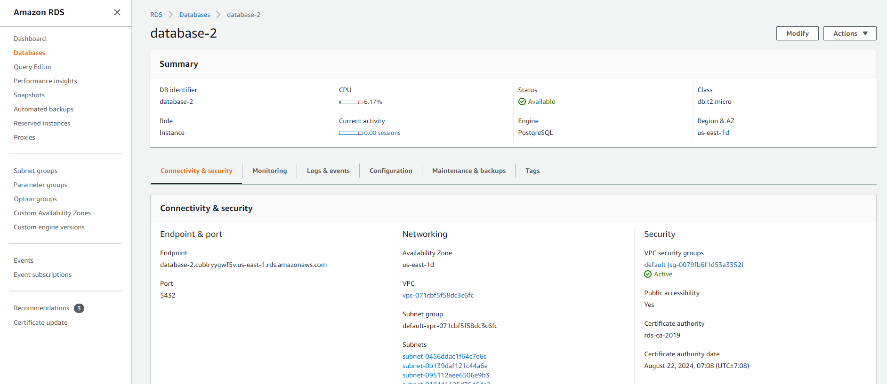

# Udagram

This project is part of the Udacity FullStack JavaScript nanodegree. The code was given as a starter project and the task was to employ and adapt the code to get it working and hosted on AWS.

The project is available at

http://udagramfrontendbucket.s3-website-us-east-1.amazonaws.com

See additional documentation in the documentation folder.

## Configuration Screenshots

### Elastic Beanstalk Environment

### FrontEnd S3 Bucket

### S3 Bucket Objects

### RDS

### Pipeline

Defineing Env Vars Here

Schema

### Infrastructure

## Built With

- [Angular](https://angular.io/) - Single Page Application Framework
- [Node](https://nodejs.org) - Javascript Runtime
- [Express](https://expressjs.com/) - Javascript API Framework

## License

[License](LICENSE.txt)
